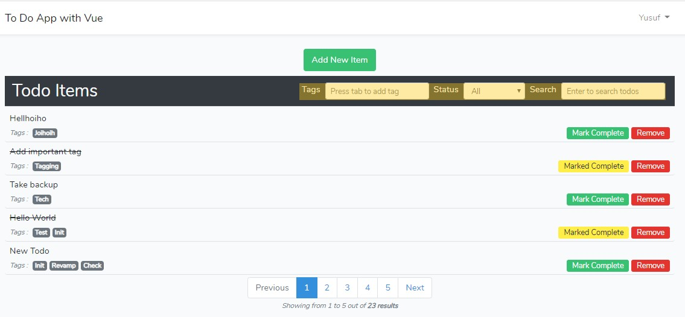
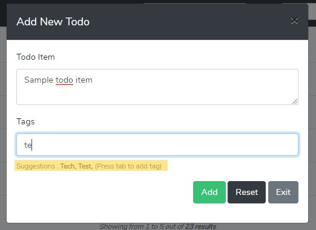

# Todo-App using Vue & Laravel
## Overview
While exploring front-end frameworks for my projects which usually have a backend built with Laravel, Vue and React seemed like the best candidates. Among the two Vue tends to be the one Laravel team and community prefers and hence I decided to explore Vue first. I couldn't use any of my existing projects in exploring the framework due to the overhead it would cause. Hence, I took a small, common and simple **Todo-App** to be built with it.

This is not a feature rich app but it has all the basic components that most todo apps have.

## Functionalities Covered
* Login and authentication
* Add or remove Todo items and view the items added by the authenticated user
* Mark Todo Items as completed or not
* Assign **tags** to todo-items
* Filter and search the items
* Basic validations

## Vue and Front-end
### Vue
First of all, *used Vue for the first time and.. **Loved It !!!***

Vue app component is placed in *"welcome.blade.php"*. All other components have this app component as root. I've divided the components as I was learning the concepts related to components. So, bear with me if you find them a little clumsy.

Below are the components used,
* alert-messages
* add-todo
* list-todo
  * todo-item
    * remove-item
  * pagination

Kindly note that all these fuctions are handled on the home url *" / "*.
> Note : Routing is only done on backend hence not reflected on browser while resolving the same. I'll be using **"vue-router"** in future projects, but decided not to integrate on this app for now.

Could make use of Vue in many ways through its data driven nature. With the help of AJAX requests it is even more exciting. Checkout the search box which reacts online realtime and the filters on tags and status on top of the Todo Items list,

Also, try typing a tag name on the **"Add New Item"** form to see suggestions from already entered tag names which are stored in database. Please note initially you wouldn't get the suggestions as the **tags** table in your database is empty. But as you add new todos with new tags, these tags would be saved in database and would be suggested in future.

### Styling
Bootstrap is used to style html, which ships with Laravel by default. Hope to use **Vuetify** next time !!

## The Back-end
The backend of this app id powered by Laravel with a MySQL database. No complex or extended code is  integrated as this was just done in order to experiment Vue. Basic Login & Authentication, CRUD on **todo items**, addition of **tags** related to todos, managing relationships and communication with the database has been taken care. 

### Login and Authentication
Basic login provided by `php artisan ui vue --auth` command.
>Note : Vue has not been integrated for login views. The default **"auth"** views that come with Laravel authentication are used. Hence don't expect to see these pages reactive..

### CRUD, Requests and Database
As mentioned above, **Laravel** is used for backend and you may find the CRUD of todo items on **App/Http/Controllers/TodoController**. Laravel's **"eloquent"** came in handy for quickly coding the queries and get required data and in required format.

The requests are handled asynchronously. jQuery is used in sending these AJAX requests and they are handled on the controllers (TodoController & TagController)

### Validations
Basic validations are done. They can be extended with little effort in order to make this app more robust and usable. Let me know if you are interested :)

## What's not covered ?
Below things haven't been covered in this project.
* Routing (front-end)
* Not focussed on a super attractive UI
* No intense validations
* Error handling and exceptions

## List of technologies used
* PHP & Javascript
* Laravel
* Vue
* jQuery (AJAX requests & others)
* Bootstrap
___
Do contact me for suggestions or feedback if any. ***Good day to you then !!!***
